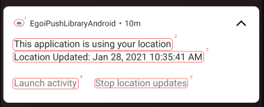
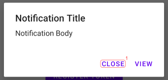

# EgoiPushLibraryAndroid

This Android library is responsible for handling all remote notifications received from E-goi's platform.

## Requirements

There are a few things you must configure in your app in order for the library to be fully functional:

1. You must have Firebase installed and configured on your app. The easiest way to do this is by following the steps in
   this [article](https://firebase.google.com/docs/android/setup#assistant).

2. You must create a service that extends Firebase's FirebaseMessagingService and declare it in your app's manifest. You
   can use the FirebaseService
   file [located in the demo app](app/src/main/java/com/egoi/egoipushlibraryandroid/FirebaseService.kt)
   and see how to declare in
   the [demo app's manifest](app/src/main/AndroidManifest.xml).
   
3. The activity that will be used to open the app from a notification must have the property **exported** set to **true**.

4. You must have an [E-goi account](https://login.egoiapp.com/signup/email) with
   a [Push application configured](https://helpdesk.e-goi.com/650296-Integrar-o-E-goi-com-a-app-m%C3%B3vel-da-minha-empresa-para-enviar-push).

## Install

This library is available through jcenter. To install it, simply add the following line to your Podfile:

```gradle
implementation 'com.egoi:egoipushlibrary:1.0.X'
```
X = latest version

After installing, you can initialize the library in the **MainActivity** with following instruction:

```kotlin
import com.egoi.egoipushlibrary.EgoiPushActivity
import com.egoi.egoipushlibrary.EgoiPushLibrary

class MainActivity : EgoiPushActivity() {

    override fun onCreate(savedInstanceState: Bundle?) {
        super.onCreate(savedInstanceState)
        setContentView(R.layout.activity_main)

        EgoiPushLibrary.getInstance(applicationContext).config(
            activityContext = this,
            activityPackage = "com.egoi.egoipushlibraryandroid",
            activityName = "MainActivity",
            appId = "abc",
            apiKey = "abc",
            deepLinkCallback = fun (link: EgoiNotification) {
                Log.d("DEEP_LINK", link.toString())
            }
        )
    }
```

**Note:** In the example above you can see that the MainActivity is extending our **EgoiPushActivity**. This is not
required but recommended since this class handles the life cycle of our location service and handles the responses of
the user to the location access requests.

## Metadata

### Location Notification



#### com.egoi.egoipushlibrary.notification_icon (1)

You should declare this metadata if you want to change the logo that is displayed on the notification. Otherwise, it will display a default logo provided by us.

The use of this metadata e recommended. The logo of the notification is one of the main things that relates the
notification with the app.

```xml
<meta-data
    android:name="com.egoi.egoipushlibrary.notification_icon"
    android:resource=">>Your resource goes here (i.e. @drawable/ic_launch)<<" />
```

#### com.egoi.egoipushlibrary.application_using_location_label (2)

You should declare this metadata if you want to customize the title of the notification that is displayed to the user when the app is in background and accessing the location. If this metadata is not declared, it will display a default message in english.

```xml
<meta-data
   android:name="com.egoi.egoipushlibrary.application_using_location_label"
   android:resource=">>Your resource goes here (i.e. @string/application_using_location)<<" />
```

#### com.egoi.egoipushlibrary.location_updated_label (3)

You should declare this metadata if you want to customize the text of the notification that is displayed to the user when the app is in background and accessing the location. If this metadata is not declared, it will display a default message in english.

```xml
<meta-data
   android:name="com.egoi.egoipushlibrary.location_updated_label"
   android:resource=">>Your resource goes here (i.e. @string/location_updated)<<" />
```

#### com.egoi.egoipushlibrary.launch_activity_label (4)

You should declare this metadata if you want to customize the text that is displayed on the action button that opens the app on the location notification. If no value is provided, a default one in english will be used.

```xml
<meta-data
   android:name="com.egoi.egoipushlibrary.launch_activity_label"
   android:resource=">>Your resource goes here (i.e. @string/launch_activity)<<" />
```

#### com.egoi.egoipushlibrary.stop_location_updates_label (5)

You should declare this metadata if you want to customize the text that is displayed on the action button that stops the location updates on the location notification. If no value is provided, a default one in english will be used.

```xml
<meta-data
   android:name="com.egoi.egoipushlibrary.stop_location_updates_label"
   android:resource=">>Your resource goes here (i.e. @string/stop_location_updates)<<" />
```

### Dialog

#### com.egoi.egoipushlibrary.close_label (1)

You should declare this metadata if you want to customize the text that is displayed on the close button of the dialog that is presented to the user. If no value is provided, a default one in english will be used.

```xml
<meta-data
   android:name="com.egoi.egoipushlibrary.close_label"
   android:resource=">>Your resource goes here (i.e. @string/close)<<" />
```

## References

### Configurations

#### EgoiPushLibrary.getInstance()

Retrieve the current instance of the library.

<table>
<thead>
<tr>
   <th>Property</th>
   <th>Type</th>
   <th>Description</th>
   <th>Required</th>
   <th>Default</th>
</tr>
</thead>
<tbody>
<tr>
   <td>context</td>
   <td>Context</td>
   <td>The context that will be used in the library to execute operations such as requesting access to the location of the device.</td>
   <td>true</td>
   <td>---</td>
</tr>
</tbody>
</table>

#### EgoiPushLibrary.getInstance().config()

Responsible for initializing the library. The call of this method is required.

<table>
<thead>
<tr>
   <th>Property</th>
   <th>Type</th>
   <th>Description</th>
   <th>Required</th>
   <th>Default</th>
</tr>
</thead>
<tbody>
<tr>
   <td>activityContext</td>
   <td>Activity</td>
   <td>The context of the activity that will be used to display the notification dialog on the app.</td>
   <td>true</td>
   <td>---</td>
</tr>
<tr>
   <td>activityPackage</td>
   <td>String</td>
   <td>The package of the activity that will be used to open the app from the notification.</td>
   <td>true</td>
   <td>---</td>
</tr>
<tr>
   <td>activityName</td>
   <td>String</td>
   <td>The activity that will be used to open the app from the notification.</td>
   <td>true</td>
   <td>---</td>
</tr>
<tr>
   <td>appId</td>
   <td>Int</td>
   <td>The ID of the app created on the E-goi account.</td>
   <td>true</td>
   <td>---</td>
</tr>
<tr>
   <td>apiKey</td>
   <td>String</td>
   <td>The API key of your E-goi account.</td>
   <td>true</td>
   <td>---</td>
</tr>
<tr>
   <td>deepLinkCallback</td>
   <td>(EgoiNotification) -> Unit</td>
   <td>Callback to be invoked when the action type of the notification is a deeplink</td>
   <td>false</td>
   <td>true</td>
</tr>
</tbody>
</table>

#### EgoiPushLibrary.getInstance().rebindService()

### Actions

#### EgoiPushLibrary.getInstance().requestForegroundLocationAccess()

Requests the user permission to access the location when the app is in the foreground (displaying on screen).

#### EgoiPushLibrary.getInstance().requestBackgroundLocationAccess()

Requests the user permission to access the location when the app is in background (minimized or closed). Only applicable
if Android version is Q or higher.

#### EgoiPushLibrary.getInstance().firebase.registerToken()

You should call this method everytime a new Firebase token is generated. The token is saved on the library and, if the
user is already registered on your E-goi list, updates the token automatically.

<table>
<thead>
<tr>
   <th>Property</th>
   <th>Type</th>
   <th>Description</th>
   <th>Required</th>
   <th>Default</th>
</tr>
</thead>
<tbody>
<tr>
   <td>token</td>
   <td>String</td>
   <td>The token generated by Firebase.</td>
   <td>true</td>
   <td>---</td>
</tr>
<tr>
   <td>field</td>
   <td>String</td>
   <td>The field on the list that will be used to register the token.</td>
   <td>false</td>
   <td>nil</td>
</tr>
<tr>
   <td>value</td>
   <td>String</td>
   <td>The value that will be used to register on the field defined above.</td>
   <td>false</td>
   <td>nil</td>
</tr>
</tbody>
</table>

## Author

E-goi, integrations@e-goi.com
